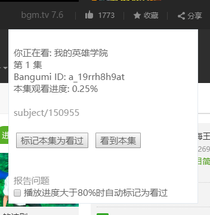

# bgm.tv auto tracker

## 介绍

在b站看番剧的同时一键在[bgm.tv](https://bgm.tv/)上标记已经看过的集数.

## 使用

首先安装[tampermonkey](https://chrome.google.com/webstore/detail/tampermonkey/dhdgffkkebhmkfjojejmpbldmpobfkfo)

然后安装此脚本
https://greasyfork.org/zh-CN/scripts/369643-bgm-tv-auto-tracker

去[https://bgm.tv/oauth/authorize](https://bgm.tv/oauth/authorize?client_id=bgm2775b2797b4d958b&response_type=code&redirect_uri=https://bangumi-auto-tracker.trim21.cn/oauth_callback)
进行授权, 授权后即可正常使用。

效果图




## 信息收集

在你的使用过程中, bgm.tv auto tracker会收集有限的信息来帮助自己变得更好.

[更多详情](./docs/user_info_collection.md)

## 开发

现已支持bilibili和iqiyi

欢迎贡献代码

server文件夹内是python服务端, 基于python>=3.6.5的aiohttp(正在使用typescript重写服务端)

```bash
cd userscript

npm i #安装依赖
npm run dev # 检测文件变动,自动重新编译
```

入口是`userscript/src/js/index.js`

使用`webpack`打包


在`Tampermonkey`中添加如下脚本,在修改原文件(`*.js`,`*.css`,`*.html`)后,会自动编译最新脚本会自动起效,刷新页面即可起效.

```javascript
// ==UserScript==
// @name        dev Bgm.tv auto tracker
// @namespace   https://trim21.me/
// @version     0.8.0
// @author      Trim21 <trim21me@gmail.com>
// @source      https://github.com/Trim21/bilibili-bangumi-tv-auto-tracker
// @license     MIT
// @match       https://www.bilibili.com/bangumi/play/*
// @match       http*://www.iqiyi.com/*
// @match       https://bangumi-auto-tracker.trim21.cn/oauth_callback*
// @match       https://bangumi-auto-tracker.trim21.cn/userscript/options*
// @require     https://cdn.bootcss.com/jquery/3.3.1/jquery.min.js
// @require     https://cdn.bootcss.com/axios/0.18.0/axios.js
// @require     https://cdn.bootcss.com/vue/2.5.16/vue.min.js
// @require     https://cdn.bootcss.com/axios/0.18.0/axios.min.js
// @grant       GM_addStyle
// @grant       GM_setValue
// @grant       GM_getValue
// @grant       GM_openInTab
// @grant       GM_addStyle
// @grant       GM_xmlhttpRequest
// @grant       unsafeWindow
// @connect     localhost
// @connect     api.bgm.tv
// @connect     bangumi-auto-tracker.trim21.cn
// @run-at      document-end
// @require      file:///path/to/bilibili-bangumi-tv-auto-tracker/userscript/env.js
// @require      file:///path/to/bilibili-bangumi-tv-auto-tracker/userscript/dist/latest/bgm-tv-auto-tracker.js
// ==/UserScript==
console.log('hello world')

```


## 已知问题

在同一集内重复点击`看到本集`会报错 这是api的设定

如果bgm的某个番没有对应条目(比如柯南的900+集),`看过本集会报错`

