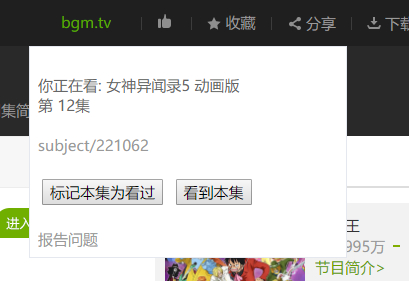

# bilibili bangumi progress auto tracker

暂定这么个名字吧

## 介绍

在b站看番剧的同时一键在bgm.tv上标记已经看过的集数.

## 使用

https://greasyfork.org/zh-CN/scripts/369643-bgm-tv-auto-tracker 

安装后去 
[https://bgm.tv/oauth/authorize](https://bgm.tv/oauth/authorize?client_id=bgm2775b2797b4d958b&response_type=code&redirect_uri=https://bangumi-auto-tracker.trim21.cn/oauth_callback)
进行授权 

效果图 

 
 
PS: 有添加优酷和其他什么乱七八糟网站支持的计划, 但是具体什么时候能加上就看心情了...(

## 开发

现在bangumi提供了官方api,又可以继续施工了.

bilibili部分已经完工了
现已支持iqiyi

欢迎贡献代码
